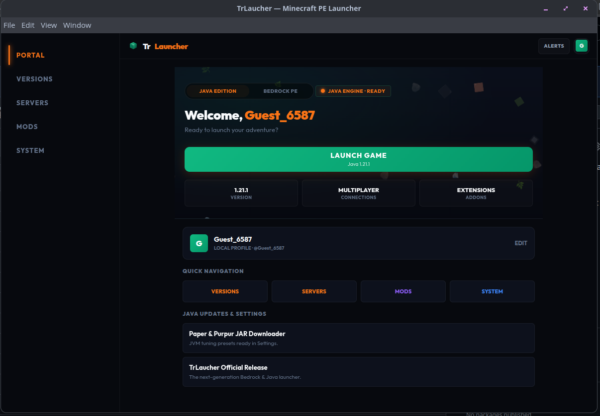

# TrLauncher - Trình Khởi Chạy Minecraft Đa Nền Tảng Cao Cấp (Java và Bedrock)

TrLauncher là một ứng dụng khách (launcher) Minecraft thế hệ mới được tối ưu hóa cho cả máy tính (Linux, Windows, macOS) và thiết bị di động (Android APK). Dự án sử dụng cùng một codebase duy nhất nhưng mang đến trải nghiệm đồ họa đồng bộ 100%, tích hợp trình xem nhân vật 3D tương tác hoàn chỉnh và các tính năng tối ưu hóa hệ thống mạnh mẽ.

---
## Ảnh demo



## Các Tính Năng Nổi Bật

### 1. Trình Xem Nhân Vật 3D Hoàn Chỉnh (3D Character Preview)
- Khối hộp 3D thực tế: Hiển thị đầy đủ 6 mặt của nhân vật (Trước, Sau, Trái, Phải, Trên, Dưới) dựa trên file Skin PNG của Minecraft.
- Xoay 360 độ mượt mà: Hỗ trợ xoay kéo chuột (trên máy tính) và vuốt chạm (trên điện thoại) không giới hạn góc nhìn, không bị giật lag nhờ thuật toán sắp xếp chiều sâu Z-depth sorting các bộ phận tránh chồng lấp hình ảnh.
- Thu phóng linh hoạt: Hỗ trợ cuộn chuột hoặc sử dụng nút bấm tăng giảm kích cỡ phóng to, thu nhỏ trực quan.
- Trình tùy biến bộ phận: Cho phép bật, tắt (ẩn, hiện) riêng biệt các bộ phận (Đầu, Thân, Tay, Chân) kèm theo bộ ghi lịch sử Undo và Redo tiện dụng.

### 2. Quản Lý Máy Chủ và Console (Server Explorer)
- Duyệt máy chủ: Theo dõi trạng thái ping, số lượng người chơi online và MOTD của máy chủ. Hỗ trợ bỏ qua kiểm tra DNS cho dải mạng LAN nội bộ.
- Bảng điều khiển: Trình tải xuống tệp chạy JAR tự động, tùy chọn phân bổ RAM dung lượng ảo (1GB đến 8GB) và bộ cờ khởi động JVM tối ưu hóa hiệu năng (Aikar's Flags).
- Sao lưu thế giới: Hỗ trợ nén lưu trữ và phục hồi các tệp thế giới nhanh chóng.
- Hộp thoại tùy chỉnh: Thay thế toàn bộ hộp thoại prompt và confirm của trình duyệt mặc định bằng các bảng trượt mở không bị chặn trên máy tính và điện thoại.

### 3. Đồng Bộ Chế Độ Sáng và Tối (Light và Dark Theme)
- Chuyển tiếp mượt mà: Hiệu ứng chuyển đổi mượt mà trên toàn hệ thống khi thay đổi giao diện (Sáng, Tối, OLED đen tuyệt đối).
- Đồng bộ nhất quán: Tự động chuyển đổi các bảng thông báo Toast, bảng trượt cài đặt, các ô nhập thông tin và màu chữ tương phản cao, tránh bị lệch hoặc lẫn nền tối.

### 4. Khởi Động Minecraft Trực Tiếp trên Máy Tính và Điện Thoại
- Phiên bản máy tính: Nhận diện IPC và liên kết sâu để mở trực tiếp launcher trên máy tính của bạn (hỗ trợ kiểm tra Prism Launcher, Official Launcher, MultiMC, Flatpak).
- Phiên bản điện thoại: Kết nối trực tiếp game Minecraft PE thông qua Capacitor AppLauncher.

---

## Yêu Cầu Hệ Thống

Để chạy hoặc đóng gói dự án, máy tính cần cài sẵn:
- Node.js (phiên bản 18 trở lên)
- NPM (phiên bản 9 trở lên)
- Git
- Thư viện Android SDK và Gradle (nếu muốn xuất file APK Android)

---

## Hướng Dẫn Cài Đặt và Phát Triển

1. Tải mã nguồn về máy:
   ```bash
   git clone https://github.com/hoangtuvungcao/TrLaucher.git
   cd TrLaucher
   ```

2. Cài đặt các gói phụ thuộc:
   ```bash
   npm install
   ```

3. Chạy ứng dụng trong môi trường phát triển (Dev server):
   ```bash
   npm run dev
   ```

4. Biên dịch mã nguồn Web (Production Build):
   ```bash
   npm run build
   ```

---

## Đóng Gói Đa Nền Tảng (Multi-Platform Compilation)

Dự án tích hợp một tập lệnh tự động hóa hoàn chỉnh build-all.sh. Khi chạy trên môi trường Linux, nó sẽ tự động biên dịch Web, sau đó gọi Electron-builder để đóng gói song song cả file thực thi cho Linux và Windows:

```bash
chmod +x build-all.sh
./build-all.sh
```

### Thành phẩm đầu ra (nằm trong thư mục dist-desktop và android):
- Windows: `dist-desktop/TrLaucher 1.0.0.exe` (Ứng dụng chạy trực tiếp không cần cài đặt)
- Linux: `dist-desktop/TrLaucher-1.0.0.AppImage` (Gói chạy độc lập trên mọi bản phân phối Linux)
- Android: `android/app/build/outputs/apk/debug/app-debug.apk` (Nếu có cài đặt SDK)

---

## Kiến Trúc Mã Nguồn

```text
├── android/             # Dự án Android (Capacitor wrapper)
├── dist/                # Tệp Web tĩnh sau khi build
├── dist-desktop/        # Gói ứng dụng PC sau khi đóng gói (AppImage, EXE)
├── electron.js          # File cấu hình khởi chạy Electron chính (PC Main Process)
├── preload.cjs          # File giao tiếp IPC an toàn giữa web app và hệ điều hành PC
├── build-all.sh         # Tập lệnh build tự động hóa đa nền tảng
├── index.html           # Khung HTML5 chính
└── src/
    ├── components/      # Các thành phần giao diện (3D character preview, Toast, v.v.)
    ├── css/             # Chứa CSS (base.css, tokens.css, pages.css)
    ├── pages/           # Logic các trang chính (home, servers, profile, settings)
    └── utils/           # Tiện ích bổ trợ (launcher, auth, storage, theme)
```

## Giấy Phép (License)

Dự án được phát triển dưới giấy phép MIT License. Bạn có quyền sử dụng, sửa đổi và đóng góp mã nguồn tự do.
